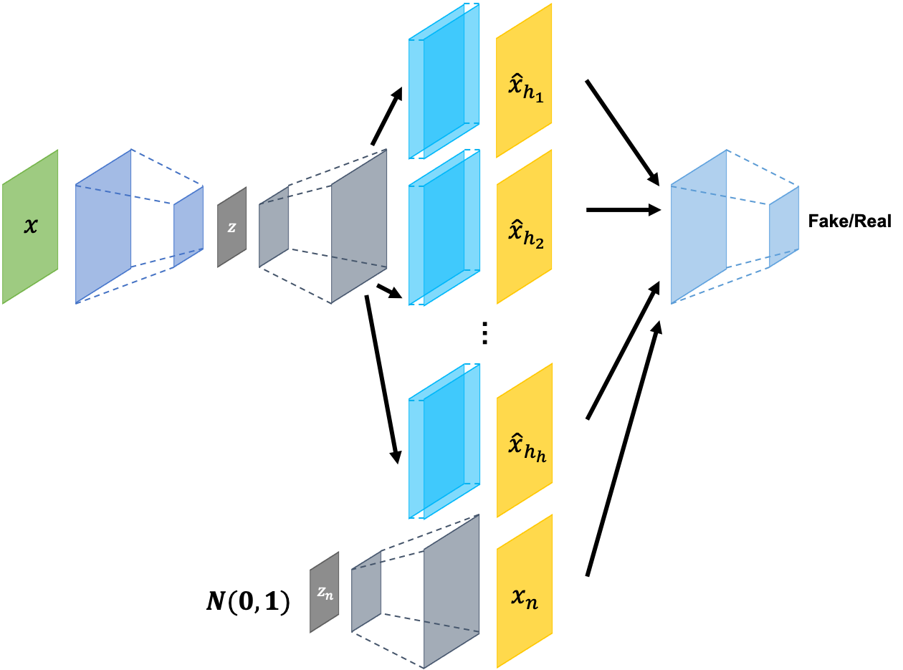
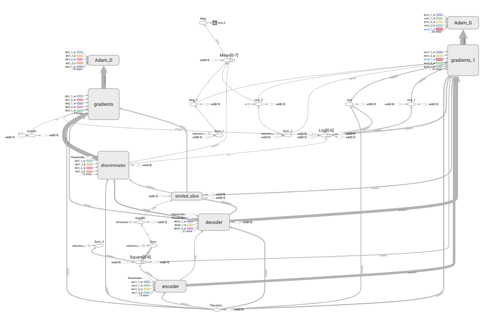
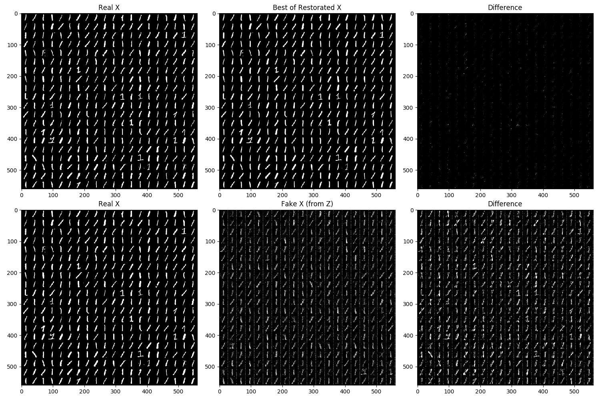
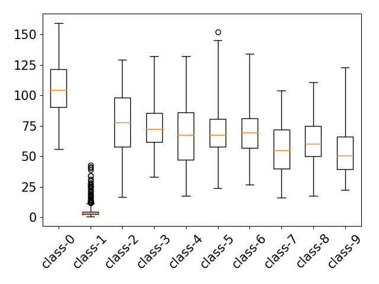
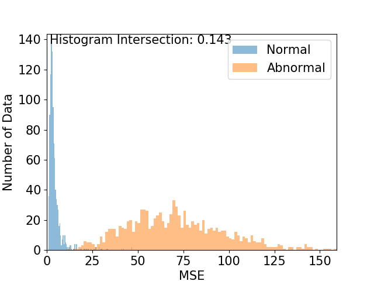
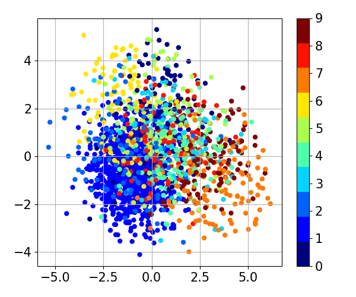

Consistency-based anomaly detection (ConAD)
=====

Implementation of Consistency-based anomaly detection (ConAD) from paper <a href="https://arxiv.org/abs/1810.13292">'Anomaly Detection With Multiple-Hypotheses Predictions'</a> with MNIST dataset [<a href="https://github.com/YeongHyeon/CVAE-AnomalyDetection">Related repository</a>].

## Architecture

    
  
Simplified ConAD architecture.

## Graph in TensorBoard

    
  
Graph of ConAD.

## Results

    
  
Restoration result by CondAD.

  
  
Box plot and histogram of restoration loss in test procedure.

  
  
Latent space of each class.

## Environment
* Python 3.7.4  
* PyTorch 1.1.0
* Numpy 1.17.1  
* Matplotlib 3.1.1  
* Scikit Learn (sklearn) 0.21.3  

## Reference
[1] Duc Tam Nguyen, et al. (2018 arXiv, 2019 ICML). <a href="https://arxiv.org/abs/1810.13292">Anomaly Detection With Multiple-Hypotheses Predictions.</a> <a href="https://icml.cc/Conferences/2019/Schedule?showEvent=4558">ICML 2019</a>.
